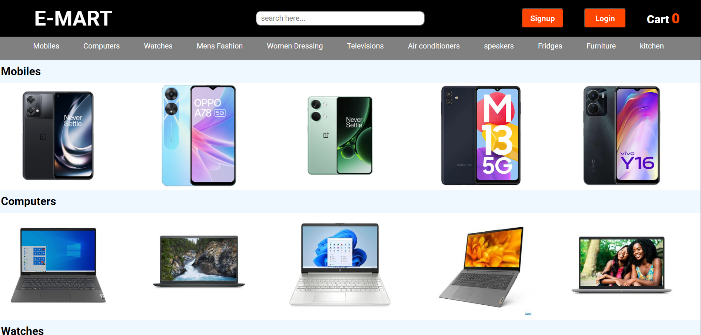
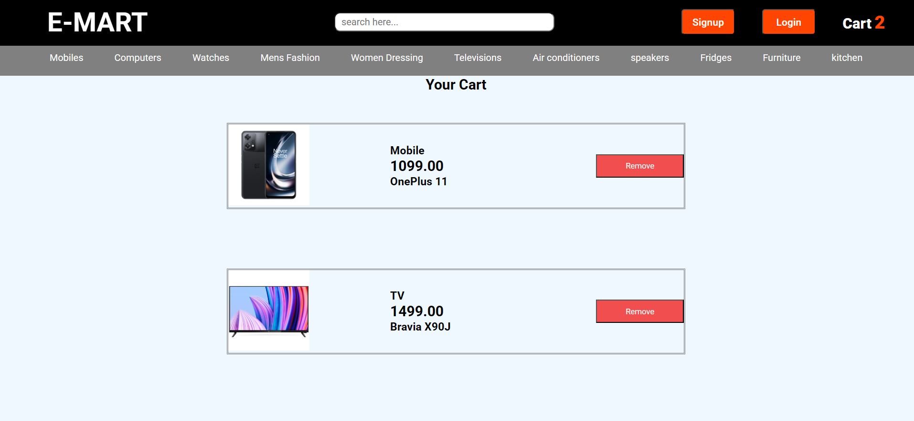

# 🛒 E-MART – React E-commerce Website

Excited to share my latest project — a **React E-commerce Website**!

This project demonstrates a modern **online shopping interface** where users can browse products, add them to the cart, and manage their shopping experience smoothly.

---

## 📸 Website Preview

### Home Page



### Cart Page



---

## 🚀 Live Demo

🔗 https://lnkd.in/eyqniW_C

---

## 💻 Source Code

GitHub Repository:
🔗 https://lnkd.in/ePa6wnFD

---

## 🛠️ Technologies Used

* **React.js**
* **JavaScript**
* **HTML5**
* **CSS3**
* **Git & GitHub**
* **Vercel (Deployment)**

---

## ✨ Features

* 🛍️ Product catalog with categories
* 🛒 Add to Cart functionality
* ❌ Remove items from cart
* 📱 Responsive design (Desktop & Mobile)
* ⚡ Fast navigation using React components
* 🎨 Clean and modern UI

---

## 🧩 Project Structure

```
E-MART
│
├── public
├── src
│   ├── components
│   ├── pages
│   ├── App.js
│   └── index.js
│
├── package.json
└── README.md
```

---

## 📦 Deployment

The project is deployed using **Vercel** for fast and secure hosting.

To deploy:

1. Push your code to **GitHub**
2. Connect your repository to **Vercel**
3. Deploy with a single click

---

## 🎯 What I Learned

During development, I focused on:

* Modern **UI/UX design**
* **Component-based architecture**
* Building a **product catalog and cart system**
* **Efficient navigation**
* Deploying real-world projects

This hands-on journey helped me strengthen my **Frontend Development** and **Deployment Skills**.

---

## 👨‍💻 Author

**Ganta Manikanta Anjaneya**

---

⭐ If you like this project, consider **starring the repository**!
